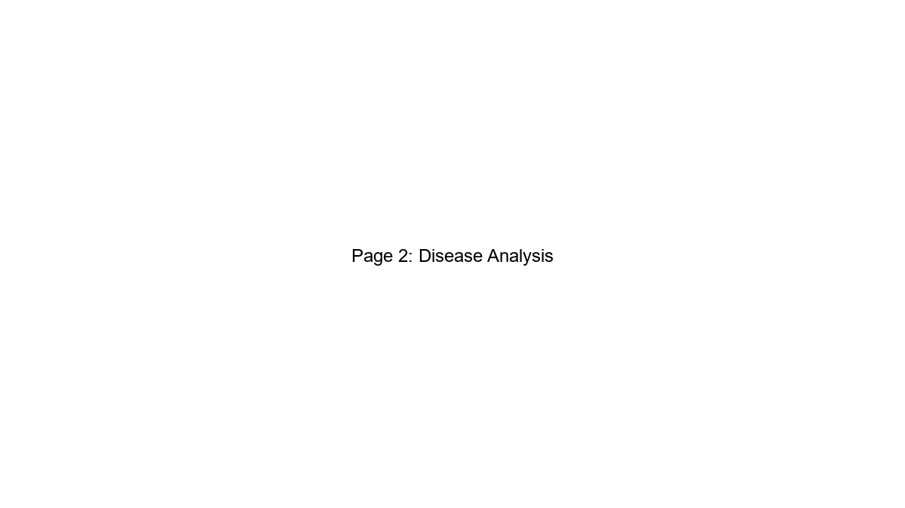
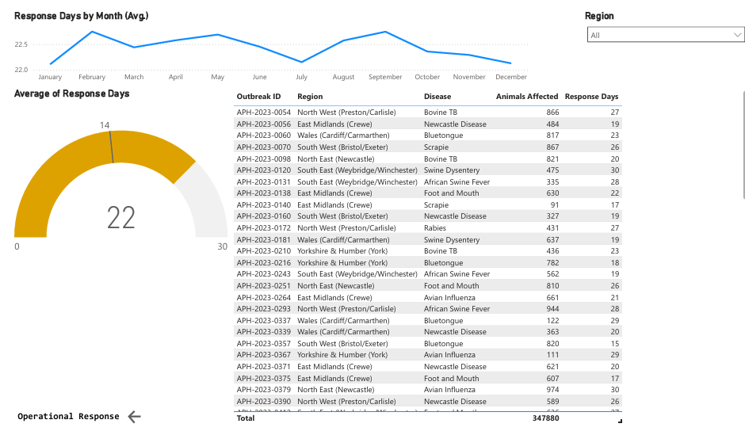

# APHA Animal Health & Welfare Outbreak Dashboard


## Overview

This project is an **end-to-end operational reporting solution** designed to showcase data analysis and product analytics skills for the **Animal and Plant Health Agency (APHA)**. The dashboard monitors animal disease outbreaks across UK regions, tracks operational response times, and identifies emerging hotspots for resource allocation.

**This is a simulated portfolio project** – the data is generated programmatically with comprehensive validation, but the dashboard design, star schema, DAX measures, and reporting logic directly reflect APHA's published reporting requirements and operational priorities.

---

## Business Problem

APHA requires a centralised dashboard to:
- Monitor disease outbreaks across 7 UK regions
- Track response times against the 14-day operational target
- Identify regional hotspots for resource allocation
- Report on an **exception basis** (High/Critical severity + response time > 14 days)
- Assess data quality through lab result breakdown (Confirmed vs Suspected vs Negative)

---

## Tech Stack

| Tool | Version | Purpose |
|:---|:---|:---|
| **Python** | 3.14+ | Data generation, validation, pandas ETL |
| **Pandas** | 3.0.3 | Data transformation & analysis |
| **NumPy** | 2.4.5 | Numerical operations |
| **Power BI Desktop** | Latest | Dashboard development, star schema, DAX, Power Query |
| **GitHub** | - | Version control & portfolio hosting |

---

## Project Structure

```
APHA-Animal-Health-Dashboard/
│
├── README.md                                    # Project overview & quick start
│
├── dashboard/
│   ├── APHA Animal Health & Welfare Dashboard.pbix   # Power BI dashboard file
│   └── APHA Animal Health & Welfare Dashboard.pdf   # Dashboard export snapshot
│
├── screenshots/
│   ├── page1_overview.png                          # Executive Overview screenshot
│   ├── page2_disease.png                           # Disease Analysis screenshot
│   └── page3_response.png                          # Operational Response screenshot
│
├── data/
│   ├── animal_health_outbreaks.csv                 # Fact table (10,000 records)
│   └── farm_reference.csv                          # Dimension table (200 records)
│
├── scripts/
│   └── Data_Generator.ipynb                        # Python notebook: data generation & validation
│
└── documentation/
    └── data_model.md                               # Complete schema and relationships documentation
```

### Key Files

| File | Purpose | Size |
|:---|:---|:---|
| `scripts/Data_Generator.ipynb` | Python data generation with 6 validation assertions | ~4 KB |
| `data/animal_health_outbreaks.csv` | Fact table with 10,000 outbreak records | ~1.2 MB |
| `data/farm_reference.csv` | Dimension table with 200 farm records | ~10 KB |
| `dashboard/APHA Animal Health & Welfare Dashboard.pbix` | Power BI desktop dashboard (3 pages) | ~3 MB |
| `dashboard/APHA Animal Health & Welfare Dashboard.pdf` | Dashboard export snapshot | ~500 KB |
| `documentation/data_model.md` | Complete schema, measures, relationships documentation | ~30 KB |
| `README.md` | Project documentation (this file) | ~25 KB |

---

## Dashboard Preview

[Click here to view the full dashboard PDF](./dashboard/APHA%20Animal%20Health%20%26%20Welfare%20Dashboard.pdf)

### Page 1: Executive Overview


### Page 2: Disease Analysis


### Page 3: Operational Response


---

## Data Model

The project uses a **complete star schema** with one fact table and three dimension tables:

```
                    ┌──────────────────────────────────────────────────────┐
                    │  ANIMAL_HEALTH_OUTBREAKS (FACT TABLE)                │
                    │  ─────────────────────────────────────────────────   │
                    │  10,000 rows | 36-month time series (May 2023-Jun26) │
                    ├──────────────────────────────────────────────────────┤
                    │ KEY COLUMNS:                                         │
                    │  • outbreak_id (PK)                    [Text]        │
                    │  • outbreak_date (FK)                  [Date]        │
                    │  • region_key (FK)                     [Text]        │
                    │  • farm_id (FK)                        [Text]        │
                    │                                                      │
                    │ DIMENSION COLUMNS:                                  │
                    │  • region, disease, animal_type        [Text]       │
                    │  • lab_result, severity                [Text]       │
                    │                                                      │
                    │ MEASURE COLUMNS:                                    │
                    │  • animals_affected (1-1,000)          [Whole #]    │
                    │  • response_days (1-30)                [Whole #]    │
                    │                                                      │
                    │ CALCULATED COLUMNS:                                 │
                    │  ├─ Animal Category (Livestock/Poultry/Wildlife)   │
                    │  ├─ Severity Group (High/Critical vs Low/Medium)   │
                    │  ├─ is_high_severity (Boolean)                     │
                    │  └─ Is Exception (Boolean) [High/Critical + >14d]  │
                    └──────────────────────────────────────────────────────┘
                              ↙                    ↓                    ↘
            ┌──────────────────────┐  ┌──────────────────────┐  ┌────────────────────┐
            │   Date (DIMENSION)   │  │ Region (DIMENSION)   │  │ Farm Ref (DIMENSION)│
            ├──────────────────────┤  ├──────────────────────┤  ├────────────────────┤
            │ Date (PK)     [Date] │  │ Region Key (PK) [Txt]│  │ farm_id (PK)  [Txt]│
            │                      │  │ Region Name     [Txt]│  │ region        [Txt]│
            │ [Standard date       │  │ APHA Operational     │  │ farm_type     [Txt]│
            │  attributes]         │  │  Area           [Txt]│  │ size          [Txt]│
            │                      │  │ Priority Region      │  │                    │
            │ Enables:             │  │  Flag        [Boolean]│  │ [200 farm records] │
            │ • Time hierarchy     │  │ Regional Target Days │  │                    │
            │ • Monthly trends     │  │  (SLA)       [Number]│  │ Relationships:     │
            │ • Seasonal analysis  │  │                      │  │ • Supports farm    │
            │                      │  │ [7 APHA regions]     │  │   capacity analysis│
            │                      │  │                      │  │ • Links regional   │
            │                      │  │ Enables:             │  │   outbreaks to     │
            │                      │  │ • Regional ranking   │  │   farm attributes  │
            │                      │  │ • Target comparison  │  │                    │
            │                      │  │ • Hotspot flagging   │  │                    │
            └──────────────────────┘  └──────────────────────┘  └────────────────────┘
```

**For detailed schema documentation, see [Data Model Reference](docs/data_model.md)**

### Fact Table: `animal_health_outbreaks`
- **10,000 records** covering 36 months (May 2023 - June 2026)
- Grain: One row per outbreak event
- Key metrics: `animals_affected` (range: 1-1,000), `response_days` (range: 1-30)
- Calculated columns for exception reporting and analytics

### Dimension Tables

#### 1. `Date` Dimension
- Provides date hierarchies (Year, Month, Day)
- Enables time-series analysis
- Supports date slicers and filters on dashboard

#### 2. `Region` Dimension
- **7 APHA Operational Areas** with metadata:
  - Region Key (surrogate key)
  - Region Name (display name)
  - APHA Operational Area mapping
  - Priority Region Flag (hotspot indicator)
  - Regional Target Days (SLA by region - 14 days)
- Enables regional performance tracking against targets

#### 3. `farm_reference` Dimension
- **200 farm records** with attributes:
  - farm_id (surrogate key)
  - region (links to Region dimension)
  - farm_type: Commercial, Smallholding, Organic, Research
  - size: Small (<50 animals), Medium (50-200), Large (200+)
- Supports farm-level analysis and capacity planning

---

## Dashboard Pages

### Page 1: Executive Overview
| Visual | Purpose | Key Metric |
|:---|:---|:---|
| KPI Card 1 | Total Outbreak Count | 10,000 |
| KPI Card 2 | Total Animals Affected | 5M+ |
| KPI Card 3 | Avg Response Days | 16 days |
| KPI Card 4 | Confirmed Outbreak Rate | 60% |
| Line Chart | Monthly Outbreak Trend | 36-month time series by year |
| Table | Regional Ranking | Hotspots identified (East Midlands leads) |

### Page 2: Disease Analysis
| Visual | Purpose | Insight |
|:---|:---|:---|
| Donut Chart | Severity Proportion | 70.42% Low/Medium, 29.58% High/Critical |
| Stacked Bar Chart | Disease by Animal Type | Disease susceptibility patterns |
| Bar Chart | Top 5 Diseases | Scrapie, African Swine Fever, Bovine TB lead |
| Donut Chart | Lab Result Breakdown | Data quality: 59.85% Confirmed, 20.12% Suspected |

### Page 3: Operational Response
| Visual | Purpose | Target |
|:---|:---|:---|
| Gauge Chart | Avg Response Days | 22 days vs 14-day target (exceeds by 8 days) |
| Exception Table | High-Priority Outbreaks | Filters: High/Critical severity AND response_days > 14 |
| Line Chart | Monthly Response Trend | Response time variance by month |

---

## DAX Measures & Calculated Columns

### Key Measures (for KPI Cards & Visuals)

| Measure | Formula | Purpose | Type |
|:---|:---|:---|:---|
| `Total Outbreak` | `COUNTROWS('animal_health_outbreaks')` | Total outbreak count | Aggregate |
| `Total Animals Affected` | `SUM('animal_health_outbreaks'[animals_affected])` | Total livestock/poultry impact | Aggregate |
| `Avg Response Days` | `AVERAGE('animal_health_outbreaks'[response_days])` | Mean operational response time | Aggregate |
| `Confirmed Outbreak Rate` | `DIVIDE(CALCULATE([Total Outbreak], 'animal_health_outbreaks'[lab_result]="Confirmed"), [Total Outbreak]) * 100` | % of confirmed vs suspected outbreaks | Ratio |
| `High Severity Count` | `CALCULATE([Total Outbreak], 'animal_health_outbreaks'[severity] IN {"High","Critical"})` | High/Critical severity outbreak count | Aggregate |
| `Regional Rank` | `RANKX(ALL('Region'[Region Name]), [Total Outbreak], , DESC, Dense)` | Region hotspot ranking (1-7) | Ranking |
| `Exception Count` | `CALCULATE([Total Outbreak], 'animal_health_outbreaks'[Is Exception]="Yes")` | Outbreaks with High/Critical severity AND response > 14 days | Filter |

### Calculated Columns (in Fact Table)

| Column | Data Type | Logic | Purpose |
|:---|:---|:---|:---|
| `Animal Category` | Text | Groups animal types into Livestock, Poultry, Wildlife categories | Stacked bar chart grouping in Disease Analysis page |
| `Severity Group` | Text | `IF([severity] IN {"High","Critical"}, "High/Critical Severe", "Low/Medium Seve")` | Donut chart grouping for severity proportion |
| `is_high_severity` | Boolean | `[severity] IN {"High","Critical"}` | Quick reference for filtering |
| `Is Exception` | Text | `IF(AND([is_high_severity]=TRUE(), [response_days]>14), "Yes", "No")` | Exception table filter on Operational Response page |
| `Avg. Response Days` | Decimal | Measure - `AVERAGE([response_days])` | Gauge chart target display |

### Dimension Table Attributes

#### Date Dimension
- Year, Quarter, Month, Week, Day of Week
- Enables monthly trend analysis (Outbreak Trend line chart)

#### Region Dimension
- **Regional Target Days**: SLA threshold per region (used in gauge calculation)
- **Priority Region Flag**: Boolean for high-priority regions (East Midlands flagged as priority)
- **APHA Operational Area**: Official area mapping

### Relationships
- **Fact → Date**: One-to-Many (1:N) on `outbreak_date`
- **Fact → Region**: One-to-Many (1:N) on `region_key`
- **Fact → Farm**: One-to-Many (1:N) on `farm_id`

---

## Data Generation & Validation

The Python notebook (`Data_Generator.ipynb`) generates synthetic outbreak data with **comprehensive validation**:

### Dataset Specifications
- **Records**: 10,000 outbreak events
- **Time Period**: 36 months (May 2023 - May 2026)
- **Regions**: 7 UK regions mapped to APHA operational areas
  - North East (Newcastle)
  - North West (Preston/Carlisle)
  - Yorkshire & Humber (York)
  - East Midlands (Crewe)
  - South West (Bristol/Exeter)
  - Wales (Cardiff/Carmarthen)
  - South East (Weybridge/Winchester)

### Disease Coverage (9 Notifiable Diseases)
- Bovine TB
- Avian Influenza
- Foot and Mouth
- Bluetongue
- African Swine Fever
- Rabies
- Swine Dysentery
- Scrapie
- Newcastle Disease

### Severity Distribution
- Low: 40%
- Medium: 30%
- High: 20%
- Critical: 10%

### Lab Results Distribution
- Confirmed: 60%
- Suspected: 20%
- Negative: 10%
- Pending: 10%

### Validation Assertions
The script includes 6 assertion checks to ensure data quality:

```python
# Date range validation
assert report_dates.dt.date.min() >= start_date.date()
assert report_dates.dt.date.max() <= end_date.date()
assert report_dates.dt.date.min() != report_dates.dt.date.max()

# Categorical validation
assert df['severity'].isin(severities).all()
assert df['lab_result'].isin(lab_results).all()
assert df['animal_type'].isin(valid_animals).all()

# Uniqueness validation
assert len(df['outbreak_id']) == df['outbreak_id'].nunique()
```

**Validation Output**: `✅ Validation successful: generated outbreak data is within the expected range and format`

---

## How to Run This Project

### Prerequisites
- Python 3.8+ with required packages
- Power BI Desktop (free download from Microsoft)

### Step 1: Install Dependencies
```bash
pip install pandas numpy python-dateutil
```

### Step 2: Generate the Data
Open `Data/Data_Generator.ipynb` in Jupyter Notebook or VS Code:
```bash
jupyter notebook Data/Data_Generator.ipynb
```

Run all cells. Expected output:
```
Validation successful: generated outbreak data is within the expected range and format
Data generation successful
Outbreak Records Created: 10000
Farm Records Created: 200
```

This generates two CSV files:
- `Data/animal_health_outbreaks.csv`
- `Data/farm_reference.csv`

### Step 3: Open the Power BI Dashboard
1. Open Power BI Desktop
2. Open `Dashboard/APHA_Animal_Health_Dashboard.pbix`
3. If data sources disconnect, repoint them to the generated CSV files:
   - File → Options and Settings → Data Source Settings
   - Select each source and update the file path
4. Click **Refresh** to reload visuals

### Step 4: Explore the Dashboard
- Use **Region** and **Date** slicers to filter data
- Hover over visuals for detailed tooltips
- Navigate between the 3 pages for different analyses
- Exception table automatically flags high-priority outbreaks

---

## Key Insights from the Dashboard

| Metric | Value | Implication |
|:---|:---|:---|
| Busiest Region | East Midlands (Crewe) – 1,489 outbreaks | Resource allocation priority |
| Most Common Disease | Scrapie (1,163 outbreaks) | Surveillance focus area |
| Response Time vs Target | 22 days average (target: 14 days) | Exceeds by 8 days – capacity issue |
| Confirmed Rate | 60% | Moderate data quality; 40% still pending/suspected |
| High Severity Proportion | 29.58% | ~3 in 10 outbreaks are High/Critical risk |
| Exception Count | 2,958+ outbreaks exceed 14-day target | Significant operational backlog |

---

## Skills Demonstrated

| Skill | Evidence |
|:---|:---|
| **Star Schema Design** | Fact table (outbreaks) + Dimension table (farms) |
| **Data Validation** | 6 assertion checks in Python; no invalid data reaches BI layer |
| **Python Data Engineering** | Data generation with Pandas, NumPy, datetime manipulation |
| **DAX Measures** | 6+ measures including ranking, aggregations, proportions |
| **Power Query** | Date cleaning, conditional columns, data type conversion |
| **Exception-Based Reporting** | Table filtered to High/Critical + response > 14 days |
| **Stakeholder Communication** | KPI cards aligned to APHA operational priorities |
| **Data Integrity** | Farm reference dimension ensuring referential integrity |

---

## APHA Statutory References

Disease-animal mappings in the data generator reflect APHA's published guidelines:
- **African Swine Fever**: Restricted to suids only (Pigs, Wild boar)
- **Avian Influenza**: Poultry, gamebirds, wild birds, and carnivores
- **Rabies**: Restricted to mammals only (per APHA statutory guidelines)
- **Bovine TB**: Multi-species risk (cattle, badgers, deer, etc.)

---

## Data Assumptions & Limitations

| Assumption | Rationale |
|:---|:---|
| Uniform date distribution | Simplifies modeling; real outbreaks follow seasonal patterns |
| Animals affected: 1-1,000 | Represents small farm to medium flock impact |
| Response days: 1-30 | Reflects realistic operational window |
| 14-day target | Aligns with published APHA response SLA |
| Lab results weighted to Confirmed | Reflects real-world confirmation bias |

---

## Future Enhancements

- [ ] Add disease-animal validation at Power BI layer (DAX)
- [ ] Include seasonal pattern adjustments in data generator
- [ ] Add time-to-result KPI (lab confirmation lag)
- [ ] Regional capacity planning visual (farms vs outbreaks ratio)
- [ ] Cost-impact estimation model (animals affected × disease severity)

---

## Acknowledgements

This project is for **portfolio purposes only**. Data is entirely simulated using realistic parameters derived from:
- APHA's published disease surveillance standards
- UK regional operational geography
- Disease-host susceptibility matrices from animal health literature

This is not a real APHA dataset or official reporting tool.

---

## License

This project is open source for portfolio demonstration. Feel free to fork, adapt, and share.

---

## Contact & Portfolio

- **GitHub**: https://github.com/jimimichael
- **LinkedIn**: www.linkedin.com/in/olujimi-michael


---

**Last Updated**: June 2026  
**Data Generation Date**: May 2026  
**Dashboard Version**: 1.0
>>>>>>> d5b24c3 (Initial portfolio project structure with Power BI dashboard, data, scripts, and documentation)
